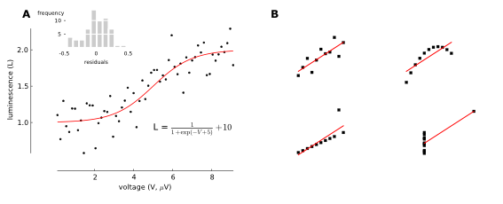

Composing multi-panel figures
=============================

As I already explained in the previous tutorial, creating figures
programmatically has many advantages. However, obtaining a complex
layout only by scripting can be very time consuming and even 
distressing. Therefore, the possible gains can be crippled by the
time spent tweaking the programs to obtain optimal results and under
time pressure many of us resort to visual editors. One way to alleviate
the problem is to use a library with little boilerplate code and which 
simplifies the common tasks (such as inserting a new panel and adjusting
its position). That's why I introduced the :doc:`compose` module, which
is a wrapper around the low-level API described in :doc:`publication_quality_figures`.

Let's take the example from the previous tutorial

To obtain this nicely-formatted final figure we needed a :ref:`considerable <transform-example-code>` amount of code. 
The same effect could be achieved in ``compose`` with fewer lines of code:

    .. literalinclude:: scripts/fig_compose.py

The ``compose`` module offers the same functionality as the ``transform``, but
rather than being based on procedural description of the figure it attempts
declarative approach. The code defining the figure mimics a hierarchical
structure typical of most figures: A figure contains multiple panels; these panels can in
turn contain several graphical elements such as text, markers or other
(sub-)panels.

Defining a figure
-----------------

Before we start we need to import the definitions from ``svgutils.compose`` module::

    from svgutils.compose import *

In `compose` the top-most element is the ``Figure()`` object. To create a figure we need to specify
its size (width and height) and its contents. For example, to create a figure consisting of a single 
imported SVG file we might write::

    Figure("16cm", "6.5cm", 
           SVG("sigmoid_fit.svg")
           )

This will create a 16-by-6.5 cm figure with showing the ``sigmoid_fit.svg`` file.
Note that the dimensions can be defined  together with units supported by SVG
(so far "px" and "cm" are implemented). If no units are defined it defaults
to "px". ``SVG()`` is another object from ``compose`` module, which simply
parses and pastes the content of a SVG file into the figure. 

The ``Figure()`` object also defines several methods; the ``save()`` method
saves the figure in a SVG file:

.. code-block:: python
   :caption: :download:`Figure preview <figures/composing_multipanel_figures/ex1.svg>`

   Figure("16cm", "6.5cm", 
          SVG("sigmoid_fit.svg")
          ).save("fig1.svg")

.. figure:: figures/composing_multipanel_figures/ex1.svg

Of course this simple example is superfluous, because it does not modify the ``sigmoid_fit.svg``
file apart from changing its size.

Arranging multiple elements
---------------------------

We may add extra elements by simpling listing them inside the ``Figure()`` object:

.. code-block:: python
   :caption: :download:`Figure preview <figures/composing_multipanel_figures/ex2.svg>`

   Figure("16cm", "6.5cm", 
          SVG("sigmoid_fit.svg"),
          SVG("anscombe.svg")
          )

This will combine two SVG files into a single figure. The problem with this
figure is that the drawing will overlap and become quite unreadable. To avoid it
we have to move figure elements. To do that automatically  you
can use ``tile()`` method of ``Figure()``, which arranges the elements
on a regular two-dimensional grid. For example, to arrange the two SVG elements
in a single row we might use:

.. code-block:: python
   :caption: :download:`Figure preview <figures/composing_multipanel_figures/ex3.svg>`

    Figure("16cm", "6.5cm", 
           SVG("sigmoid_fit.svg"),
           SVG("anscombe.svg").scale(0.5)
           ).tile(2, 1)

.. figure:: figures/composing_multipanel_figures/ex3.svg

For more control over the final figure layout  we can position the
individual elements using their ``move()`` method:

.. code-block:: python
   :caption: :download:`Figure preview <figures/composing_multipanel_figures/ex4.svg>`

    Figure("16cm", "6.5cm", 
           SVG("sigmoid_fit.svg"),
           SVG("anscombe.svg").move(280, 0)
           )

This will move the ``ansombe.svg`` 280 px horizontally. Methods can be also
chained:

.. code-block:: python
   :caption: :download:`Figure preview <figures/composing_multipanel_figures/ex5.svg>`

   Figure("16cm", "6.5cm", 
          SVG("sigmoid_fit.svg"),
          SVG("anscombe.svg").scale(0.5)
                             .move(280, 0)
          )

It's often difficult to arrange the figures correctly and it can involve mundane
going back and fro between the code and generated SVG file. To ease the process
``compose`` offers several helper objects: The ``Grid()`` object generates a grid of
horizontal and vertical lines labelled with their position in pixel units. To
add it simply list ``Grid()`` as one of ``Figure()`` elements:

.. code-block:: python
   :caption: :download:`Figure preview <figures/composing_multipanel_figures/ex6.svg>`

    Figure("16cm", "6.5cm", 
           SVG("sigmoid_fit.svg"),
           SVG("anscombe.svg").scale(0.5)
                              .move(280, 0),
           Grid(20, 20)
           )

The two parameters of ``Grid()`` define the spacing between the vertical and
horizontal lines, respectively. You can use the lines and numerical labels to
quickly estimate the required vertical and horizontal shifts of the figure
elements.

Grouping elements into panels
-----------------------------

Figures prepared for publications often consist of sub-panels, which can
contain multiple elements such as graphs, legends and annotations (text, arrows
etc.). Although it is possible to list all these elements separately in the
``Figure()`` object, it's more convenient to work with all elements belonging to
a single panel as an entire group. In ``compose`` one can group the elements
into panels using ``Panel()`` object:

.. code-block:: python
   :caption: :download:`Figure preview <figures/composing_multipanel_figures/ex7.svg>`

   Figure("16cm", "6.5cm", 
          Panel(
             Text("A", 25, 20),
             SVG("sigmoid_fit.svg")
             ),
          Panel(
             Text("B", 25, 20).move(280, 0),
             SVG("anscombe.svg").scale(0.5)
                                .move(280, 0)
             )
          )

``Panel()`` just like a ``Figure()`` object takes a list of elements such as
text objects or SVG drawings. However, in contrast to ``Figure()`` it does not
allow to define the size and does not offer ``save()`` method. The two ``Panel()``
objects of this example contain each a text element and a SVG file. The
``Text()`` object not surprisingly creates a text element -- in addition to the
text itself we can pass (optional) position arguments (alternatively we could
just use ``move()`` method of the ``Text()`` object). 

In this example the ``Panel()``
object serve no other role than grouping elements that refer to a single panel
-- it may enhance the readability of the code generating the figure, but it does
not simplify the task of creating the figure. In the second ``Panel()`` we apply
twice the method ``move()`` to position both the text element and the SVG. The
advantage of ``Panel()`` is that we can apply such transforms to the entire
panel:

.. code-block:: python
   :caption: :download:`Figure preview <figures/composing_multipanel_figures/ex8.svg>`

   Figure("16cm", "6.5cm", 
          Panel(
             Text("A", 25, 20),
             SVG("sigmoid_fit.svg")
             ),
          Panel(
             Text("B", 25, 20),
             SVG("anscombe.svg").scale(0.5)
             ).move(280, 0)
          )

This way we simplified the code, but also the change allows for easier
arrangement of the panels. An additional advantage is that the ``tile()`` method
will automatically arrange the entire panels not the individual elements.
